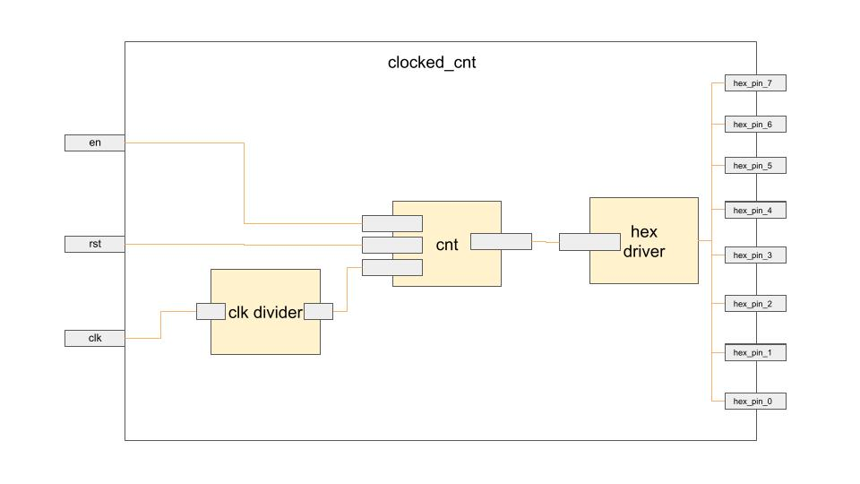

# Hex Counter Display

In this episode the description of how a counter con be istantiated on the real FPGA (not only modelsim simulation) in order to use the physical resources of the Altera FPGA. In my case I deployed on the Terasic DE10-Lite, which is the reference board for these class.

# Component architecture

  

The figure above represents the high-level view of the schematic of the final component you can find in the 03-clocked_cnt directory.  
The component is built using 3 lower-level entities, represented in yellow in the figure above. For each building block you can find the implementation and the relative testbench on the dedicated directories, whose names are numbered indicating the implementation sequence in a bottom-up fashion.     

In particular we have:

- **00-clock_divider** ⟶  It is used to scale the clock provided by the board, in my case 50MHz, to a frequency that allows to see meaningful data on the 7-segment display. The value set in this final version produce a 1Hz clock signal, meaning data will change once per second on the screen.
- **01-cnt** ⟶  It is used to count on the rising edge of the clock and the counter value (4-bit counting from 0x0 to 0xF) is used to access a LUT containing the corresponding value to be show on the display.
- **02-hex_driver** ⟶  It implements a LUT that receives the counter value as address and outputs the byte (8-bit) containing the encode of the counter/address value to plot the same number as visible output on the 7-segment display. 

