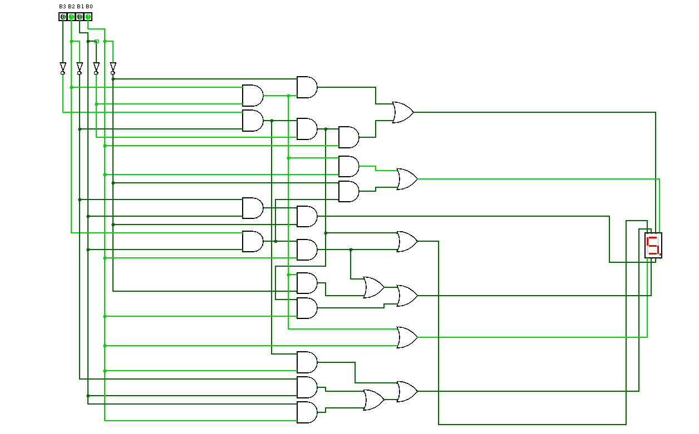

# Hex Counter Display

In this episode we implemented a 7-segments display decoder using logic gates for a possible discrete integrated circuits (ICs) implementation. In my case I deployed on the Terasic DE10-Lite, which is the reference board for these class.

# Component architecture

  

The figure above represents the schematic of the decoder we obtained from logic equations derived by Karnaugh maps.  
For every output, which are represented by the 7 segments of the display, we encoded the logic function implementing its truth table as can be seen in the Altera .bdf file where I highlighted every contribution of each logic function (the picture below).     

  

In particular we have:

- **00-clock_divider** ⟶  It is used to scale the clock provided by the board, in my case 50MHz, to a frequency that allows to see meaningful data on the 7-segment display. The value set in this final version produce a 1Hz clock signal, meaning data will change once per second on the screen.
- **01-cnt** ⟶  It is used to count on the rising edge of the clock and the counter value (4-bit counting from 0x0 to 0xF) is used to access a LUT containing the corresponding value to be show on the display.
- **02-hex_driver** ⟶  It implements a LUT that receives the counter value as address and outputs the byte (8-bit) containing the encode of the counter/address value to plot the same number as visible output on the 7-segment display. 

