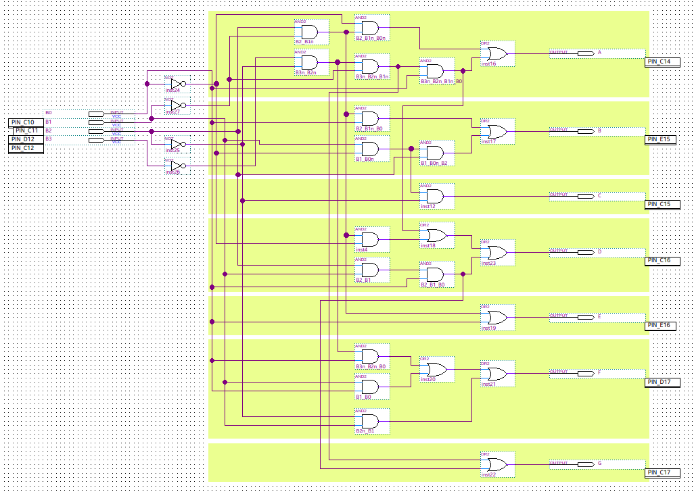

# 7-Segments Display Decoder

In this episode we implemented a 7-segments display decoder using logic gates for a possible discrete integrated circuits (ICs) implementation. In my case I deployed on the Terasic DE10-Lite, which is the reference board for these class.

# Component architecture
The figure below represents the schematic of the decoder we obtained from logic equations derived by Karnaugh maps.  
For every output, which are represented by the 7 segments of the display, we encoded the logic function implementing its truth table as can be seen in the Altera .bdf file where I highlighted every contribution of each logic function.     

  
  

